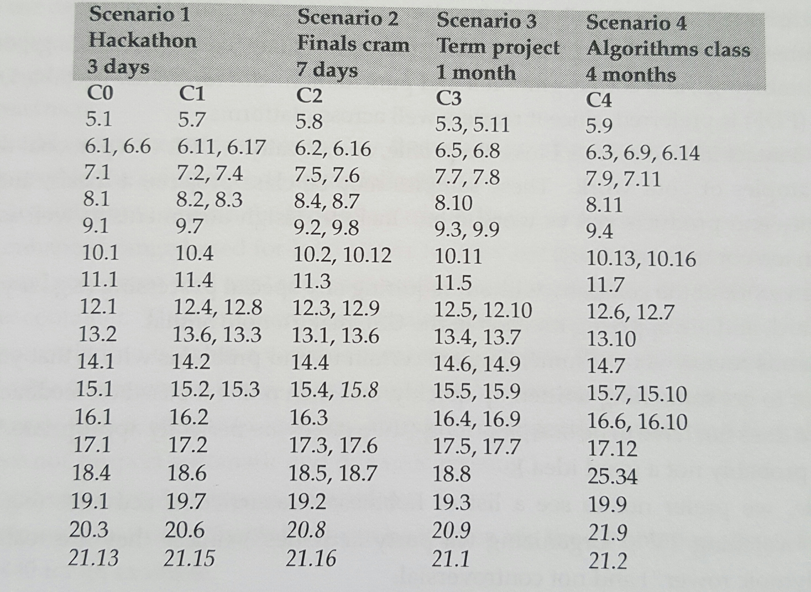

# DataStructureImplementations
Personal Studies and Implementation of Core Data Structures in C++

---

### Elements of Programming Interviews ###

**Study Scenario** - 1 Month

1.5 - 2.5 hours a day for 1 month

*   Start with Chapter 4
*   For each Chapter following:
    *   read intro
    *   if not italics, write code
    *   write and test code for cloumns 0 to i-1
    *   write pseudo-code for problem i

---

### TODO ###

*   Implement Google Test in order to use CHECK() rather than assert for unit tests

*   Remove all areas where an exception is thrown and figure out alternative way to handle logic errors and proper cleanup

